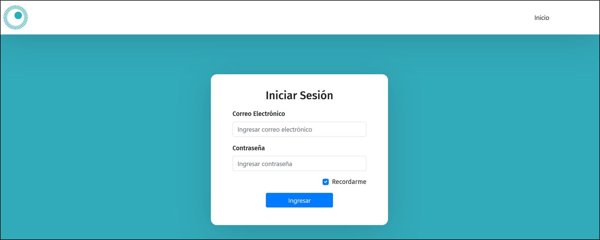

# TPO - Validar Encuesta

Para el Observatorio PYME se participará en el proceso de auditoria de pequeñas y medianas empresas poniendo foco en la validacion de las encuestas que se envian a tales empresas.

## ¿Para quién está pensada esta solución?
---
Para toda persona que pertenezca al Observatorio que desempeñe el rol de validador o bien analista (Filler) de encuesta, quienes podrán contar con las encuestas recibidas de las PYME's para luego revisarlas, validarlas, escribir comentarios y demás.

## Instalación
---
Pasos para la instalación

1) Abrir una terminal (CMD, PowerShell, o Bash)
2) Dirigirse a la ubicación en donde se alojará el proyecto
3) Correr el siguiente comando: 'git clone https://github.com/39208750/API.git '. Esto descargará el proyecto de GitHub a la ubicación seleccionada.
4) Abrir Visual Studio Code
5) Abrir el proyecto
6) Abrir una nueva terminal de VS Code. Para eso, en la parte superior del editor: 'Terminal -> new terminal'
7) Corra el siguiente comando: 'npm install'. Esto instalará todos los módulos y dependencias requeridas para correr el proyecto de forma local.
8) Corra el siguiente comando: 'npm start'. Esto iniciará el proyecto, abriendo una ventana de su último buscador utilizado.

# Casos de usos.

## Autenticación

- ### Inicio de sesión de un usuario registrado.
  Desde la pantalla de logIn se nos solicitará el Correo Electronico y Contraseña. Luego de completar tales campos debemos presionar en "Ingresar" para iniciar sesión.

  

---
## Roles

- ### Vista de Aministrador.    
  Este rol posee permisos para realizar Alta, Baja y Modificacion de los Usuarios que cumplan la funcion de Validador o Filler asi como tambien Visualizar las encuestas de cada una de las empresas.
  Desde el Home del Administrador se podrá:
  1) Visualizar las empresas y sus encuestas 
  2) Buscar una empresa por su correo electronico.
  3) Buscar una encuesta por su nombre
  4) Acceder al menu de Gestion de Usuarios para dar de alta un nuevo usuario, una baja de usuario existente y por ultimo modificacion en el Rol y/o correo electronico de un usuario.

  #### Home Administrador
  

  #### Home Gestion Usuarios 
  

- ### Vista de Filler
    Tal rol se encarga de recibir una encuesta completada por una empresa y verificar que las mismas cuenten con sus respuestas acorde a las preguntas designadas. Sobre cada pregunta habrá un boton que le permitirá a este rol indicar si la respuesta esta conforme o no a la pregunta.
    Si el Filler encuentra las respuestas de manera acorde, podrá enviar la encuesta para validar. En caso contrario completará la/s preguntas que deben revisarle y solicitará una revisión.

  #### Home Filler
  

  #### Filler Recibiendo revision del Validador
  

  #### Filler Agregando Respuesta
  
  

- ### Vista de Validador
    Este rol puede visualizar cada una de las encuestas que poseen las empresas listadas. Ya que su actividad consiste en aprobar las encuestas completadas que fueron revisadas previamente por el analista (o Filler), podrá aprobar la encuesta en caso que todos los campos estén acorde a lo esperado o bien realizar comentarios sobre uno/varios campos que necesitan una revision, asi como tambien dejar un comentario general.

  #### Home Validador
    
    
  #### Vista Encuesta a Validar
    

  #### Aprobar Encuesta
    

  #### Enviar Comentarios al Filler
    

  #### Respuesta del Filler al Validador
  

---
## Ingresos

- ### Ver ingreso acumulado.
    Una vez posicionado en la sección de ingresos, se encuentra un display principal que indica el ingreso acumulado según el período de tiempo que se muestra debajo.

    

- ### Registro de un nuevo ingreso.
    Para registrar un nuevo ingreso se debe completar el formulario con los datos solicitados y presionar el botón.
    - Al seleccionar 'Moneda' se encuentran las opciones: pesos o dóalres.
    - Al seleccionar 'Fuente' se encuentran las opciones: alquiler, sueldo, facturación o extraordinario.
    - Al seleccionar 'Medio' se encuentran las opciones: efectivo o transferencia bancaria.
      - Si seleccionamos transferencia bancaria, tendremos que elegir una cuenta bancaria vinculada del usuario. 

    

- ### Ver historial de ingresos.
    Deslizando hacia abajo, se encuentra una tabla que representa un historial de todos los ingresos que se realizaron el el periódo de tiempo seleccionado.

    
  - ### Ver detalle de un ingreso.
    Al pulsar sobre el botón '+', se puede ver un detalle con toda la información del ingreso.

    

    - ### Eliminar un ingreso.
        Cuando se esta visualizando un detalle, pulsando el botón 'borrar' se elimina el registro de esa transacción.

        

- ### Filtrar datos de ingresos por período de tiempo.
    Para modificar toda la información mostrada, se debe seleccionar el período de tiempo deseado como se indica en la imagen. Se puede seleccionar: anual, semestral o mensual.

    

---
## Egresos

- ### Ver egreso acumulado.
    En la parte superior, se encuentra un display principal que indica el egreso acumulado según el período de tiempo que se muestra debajo.

    

- ### Registro de un nuevo egreso.
    Para registrar un nuevo egreso se debe completar el formulario con los datos solicitados y presionar el botón. También se puede añadir un comprobante.
   - Al seleccionar 'Moneda' se encuentran las opciones: pesos o dóalres.
  - Al seleccionar 'Tipo' se encuentran las opciones: servicio, impuestos nacionales, impuestos provinciales, impuestos municipales, educación, salud, gastos varios, comida, entretenimiento, viáticos u otros.
    - Si seleccionamos servicio, tendremos que elegir una el tipo de servicio: luz, agua u otro.
      - Si seleccionamos otro, debemos detallar el servicio.
  - Al seleccionar 'Medio' se encuentran las opciones: efectivo, transferencia bancaria, tarjeta de crédito o tarjeta de débito.
    - Si seleccionamos transferencia bancaria, tendremos que elegir una cuenta bancaria vinculada del usuario.
    - Si seleccionamos tarjeta de crédito o débito, tendremos que elegir una tarjeta vinculada del usuario.

    

- ### Ver historial de egresos.
    Bajando se encuentra una tabla historial de todos los egresos realizados.

    

  - ### Ver detalle de un egreso.
    Al pulsar sobre el botón '+', se puede ver un detalle con toda la información del egreso.
    
    

    - ### Eliminar un egreso.
        Cuando se visualiza un detalle, pulsando el botón 'borrar' se elimina el registro de esa transacción.

    - ### Ver archivo adjunto.
      Para visualizar el archivo adjunto debemos pulsar 'Abrir adjunto' y se veerá el archivo debajo de la tabla de historial.

      

- ### Filtrar datos de egresos por período de tiempo.
    Para modificar toda la información mostrada, se debe seleccionar el período de tiempo deseado como se indica en la imagen. Se puede seleccionar: anual, semestral o mensual.

    

---
## Tarjetas

- ### Ver tarjetas del usuario.
  Las tarjetas se visualizan en un carrusel, desplazando hacia la izquierda avanzamos en las tarjetas del usuario. La información mostrada en pantalla, es correspondiente a la tarjeta seleccionada.

  

- ### Agregar nueva tarjeta.
  Para agregar una tarjeta se debe precionar el boton '+' que se encuentra arriba a la derecha de las tarjetas.
    - Al seleccionar 'Tipo' se encuentran las opciones: crédito y débito.
    - Al seleccionar 'Cuenta bancaria' se encuentran un listado de las cuentas bancarias vinculadas del usuario.

  

  

- ### Ver egreso acumulado por tarjeta.
  En la parte central de la pantalla, se encuentra un display principal que indica el egreso acumulado según el período de tiempo que se muestra debajo, de la tarjeta seleccionada.

  

- ### Solicitar información en fecha de cierre resumen.
  El contador que se encuentra debajo del date picker, indica cuánto tiempo falta para que se cumpla la fecha de cierre resumen. Al llegar a 0, solicita ingresar la nueva fecha de cierre resumen y de vencimiento resumen.

  

- ### Ver historial de egresos por tarjeta.
  Bajando se encuentra una tabla historial de todos los movimientos realizados con la tarjeta seleccionada.

  
    - #### Ver detalle de un movimiento.
      Al pulsar sobre el botón '+', se puede ver un detalle con toda la información del movimiento.

      

- ### Filtrar datos de egreso por período de tiempo.
  Para modificar toda la información mostrada, se debe seleccionar el período de tiempo deseado como se indica en la imagen. Se puede seleccionar: anual, semestral o mensual.

  

---
## Cuentas bancarias

- #### Ver cuentas bancarias del usuario.
  Las cuentas bancarias se visualizan en un carrusel, desplanzado hacia la izquierda avanzamos en las cuentas vinculadas del usuario. La información mostrada en pantalla, es correspondiente a la cuenta seleccionada.

  

- ### Agregar nueva cuenta.
  Para agregar una nueva cuenta bancaria, debemos completar el forumalrio que aparece debajo del display, ingresando el titular, CBU y banco de la cuenta.

  

- ### Ver saldo actual de la cuenta.
  Debajo de la información de la cuenta, se encuentra un display con el saldo actual de la cuenta seleccionada.

  

- ### Ver historial de transacciones de la cuenta.
  Al bajar, se encuentra una tabla que nos muestra un listado de los movimientos realizados desde esa cuenta.

  

## Inversiones

- ### Ver gráficos de inversiones.
  Si ya tenemos inversiones registradas, se ve un carrusel con diversos gráficos que representan las inversiones del usuario.

  

- ### Agregar nueva inversión.
  Para agregar una nueva inversión del usuario, debe completar el formulario ingresando el monto de la inversión en pesos argentinos.
  - Al seleccionar 'Tipo' se encuentran las opciones: Plazo fijo, compra de titulos, acciones, bienes raices, energias renovables, divisas, bono, comodities y futuros.
  - Al seleccionar 'Plazo fijo' nos solicita ingresar el interés anual en %.
  - Al seleccionar 'Acciones' nos solicita ingresar el nombre de la empresa.

  

- ### Ver historial de inversiones.
  Al bajar, se encuentra una tabla que nos muestra un listado de las inversiones realizadas del usuario.

  
    - #### Ver detalle de una inversión.
      Al pulsar el '+' de la derecha, se muestra la información detallada de la inversión.

      
      - #### Eliminar una inversión.
        Cuando se visualiza un detalle, pulsando el botón 'borrar' se elimina el registro de ese movimiento.

---
## Prestamos

### (Dinero prestado)
Al ingresar en la sección de préstamos, primero veremos toda la información asociada a prestamos que donde el usuario es el prestamista.

- ### Ver total de dinero prestado.
  Tendremos un display que indica el dinero total prestado.

  

- ### Añadir nuevo dinero prestado.
  Debajo del display, tenemos un formulario para ingresar la información pertinente cuando prestamos dinero. 
  - Al seleccionar 'Moneda' se encuentran las opciones: pesos o dóalres.
  - Al seleccionar 'Medio' se encuentran las opciones: Efectivo o Transferencia Bancaria.
  - Al seleccionar 'Transferencia Bancaria' se debe seleccionar una cuenta asociada del usuario.
  
  

- ### Ver historial de dinero prestado.
  Al bajar, se encuentra una tabla que nos muestra un listado del dinero prestado del usuario.

  

    - #### Ver detalle de un dinero prestado.
      Al pulsar el '+' de la derecha, se muestra la información detallada del dinero prestado.

      

      - ### Eliminar un dinero prestado.
        Cuando se visualiza un detalle, pulsando el botón 'borrar' se elimina el registro de ese movimiento.

- ### Filtrar el dinero prestado por período de tiempo.
  Para modificar toda la información mostrada, se debe seleccionar el período de tiempo deseado como se indica en la imagen. Se puede seleccionar: anual, semestral o mensual.

  

### (Dinero tomado)
Si bajamos hasta la mitad inferior de la sección, encontraremos la información relacioanda al dinero que tomó prestado el usuario.

- ### Ver total de dinero tomado.
  Tendremos un display que indica el dinero total tomado.

  

- ### Añadir nuevo dinero tomado.
  Debajo del display, tenemos un formulario para ingresar la información pertinente cuando tomamos prestado dinero.

- Al seleccionar 'Moneda' se encuentran las opciones: pesos o dóalres.
- Al seleccionar 'Medio' se encuentran las opciones: Efectivo o Transferencia Bancaria.
- Al seleccionar 'Transferencia Bancaria' se debe seleccionar una cuenta asociada del usuario.
- Al selecciona 'Cuotas' debemos seleccionar en cuántas cuotas hemos tomado el préstamo.

  

- ### Ver historial de dinero tomado.
  Al bajar, se encuentra una tabla que nos muestra un listado del dinero tomado por usuario.

  

  - #### Ver detalle de un dinero tomado.
     Al pulsar el '+' de la derecha, se muestra la información detallada del dinero tomado.

    

  - ### Eliminar un dinero tomado.
    Cuando se visualiza un detalle, pulsando el botón 'borrar' se elimina el registro de ese movimiento.

---

## Presupuesto
En esta sección podremos agregar un presupuesto mensual que estimamos gastar. Este se debe seccionar por distintos tipos.

- ### Añadir presupuesto mensual.
  Para agregar un nuevo presupuesto mensual, debemos completar el formulario.
  - Al seleccionar 'Tipo' se encuentran las opciones: servicio, impuestos nacionales, impuestos provinciales, impuestos municipales, educación, salud, gastos varios, comida, entretenimiento, viáticos u otros.
  - Si seleccionamos servicio, tendremos que elegir una el tipo de servicio: luz, agua u otro.
    - Si seleccionamos otro, debemos detallar el servicio.

  

- ### Ver comparación de presupuesto versus real.
  Debajo del formulario de agregar presupuesto, vemos un grafico comparativo donde podremos ver el presupuesto estimado versus el presupuesto real, diferenciado por los distintos tipos que fuimos dando de alta.

  

  ---

  ## Configuración

  

  - ### Back-up
    Si queremos realizar un back-up de nuestros datos, debemos pulsar el boton 'Generar back-up'. Esto impacta en nuestra base de datos en la nube (mongoDB), quedando almacenados de manera permanente.

  - ### Recuperar Back-up
    Si queremos recuperar un back-up que hemos almacenado anteriormente, debemos pulsar el boton 'Recuperar Back-up'. Esto traerá la última copia realizada de nuestra base de datos en la nube e impactará en toda la información mostrada en la aplicación.

  - ### Exportar CSV
    Para exportar todos nuestros datos de usuario fuera de la aplicación en formato 'CSV', debemos pulsar el boton 'Exportar CSV'. Esto nos creará un documento de ese formato y nos permitirá compartirlo en las principales aplicaciónes que tengamos en nuestro dispositivo.